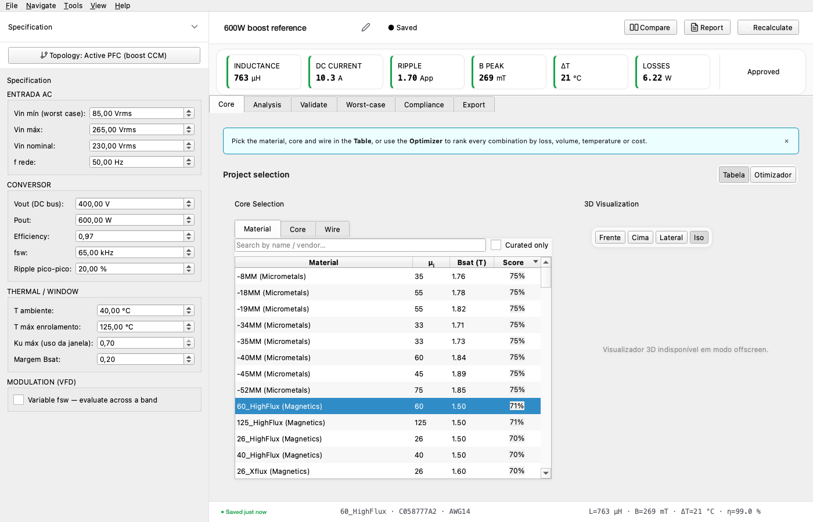

# 1. Workspace overview

MagnaDesign opens to a workspace built around four sidebar
sections: **Project**, **Optimizer**, **Catalogue**, and
**Settings**. Almost all design work happens on the **Project**
page; the other three are for batch optimisation, the parts
database, and app-level preferences respectively.

## The Project page at a glance

| Region | Purpose |
|---|---|
| **Sidebar** (far left, navy bar) | Switch between the four top-level pages. |
| **Spec drawer** (collapsible left column) | Enter the converter specification — input voltage, output, power, frequencies, environment limits. |
| **Workspace header** (top of right column) | Project-name field + the four primary action CTAs (Recalculate, Compare, Validate, Export). |
| **KPI strip** (just below the header) | Six headline numbers — L, Ku, B_pk, ΔT, total losses, status. Updates on every recalculate. |
| **Tabs** | Five workspace tabs covering the design lifecycle. See chapter 1.1 below. |
| **Scoreboard** (bottom strip) | Status indicator (FEASIBLE / WARNINGS / ERROR) plus the bottom-bar Recalculate button. |

## 1.1 The five workspace tabs

The work splits across five tabs in this exact order — left to
right is also chronological. Newer designs flow left-to-right;
established designs are reviewed right-to-left.

| # | Tab | What it answers | Detailed in |
|---|---|---|---|
| 1 | **Core** | Which material / core / wire combination should I pick? Inline optimiser ranks candidates against the spec. | [Chapter 3](03-core-selection.md) |
| 2 | **Analysis** | How does the chosen design behave? Waveforms, B–H trajectory, saturation rolloff (L vs I), power factor (PF vs L), throughput (P vs L), losses, thermal, winding. | [Chapter 4](04-analysis-tab.md) |
| 3 | **Validate** | Does FEA agree with the analytic engine? FEMMT (open-source) or legacy FEMM cross-check. | [Chapter 7](07-fea-validation.md) |
| 4 | **Compliance** | Does the design pass the standards the spec targets? IEC 61000-3-2 Class D / 61000-3-12 / IEEE 519, hi-pot, Ku, thermal. | covered inside chapter 4 |
| 5 | **Export** | How do I share / file / archive the design? Datasheet PDF, Project Report PDF, Comparison PDF/HTML/CSV. | [Chapter 8](08-exports.md) |

## 1.2 Recalculate vs auto-update

The engine **does not** re-run automatically when you tweak a
spec field. Editing inputs marks the workspace as *unsaved* and
turns the **Recalculate** CTA into the colour-active state. Click
it (or press <kbd>Ctrl</kbd>+<kbd>R</kbd>) to commit the change.

This is deliberate — the engine takes 50–500 ms per run and
materialising every keystroke would feel laggy. The pattern
matches the Recalculate button at the bottom-right scoreboard
(same effect, two locations for muscle memory).

## 1.3 What "feasible" actually means

The Scoreboard's status pill summarises three checks:

- **Bpk < Bsat · (1 − margin)** — flux density stays below the
  hot-saturation limit with the configured Bsat margin (default 20 %).
- **Ku ≤ Ku,max** — winding fits in the bobbin window with
  room for insulation (default ceiling 70 %).
- **Twinding ≤ Tmax** — converged thermal solution stays
  within the spec's max winding temperature (default 105 °C).

A pass on all three turns the pill green (FEASIBLE). Any failure
turns it amber/red (WARNINGS / ERROR) and lists the specific
metric that broke in the warnings panel.
