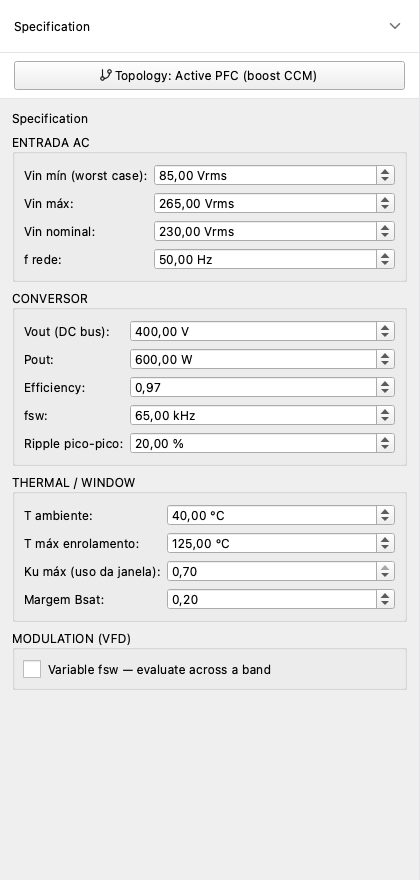

# 2. Spec drawer — entering the design specification

The Spec drawer lives on the left edge of the Project page. It
groups every input the engine needs to size the inductor. The
drawer scrolls; collapse it (top-right chevron) when you want
the full workspace width to read a chart.

## 2.1 Topology selector

The first control. Picking a topology reshapes the rest of the
drawer — different topologies have different relevant
parameters.

| Topology | Spec section | Typical use |
|---|---|---|
| **Active boost-PFC (CCM)** | Vin range / Vout / Pout / fsw / ripple % | Single-phase universal-input PFC |
| **Interleaved boost PFC** | Vin range / Vout / Pout (total) / fsw / ripple % / `n_interleave` ∈ {2, 3} | Server PSUs, EV chargers, 1.5 – 22 kW |
| **Buck (sync DC-DC)** | Vin / Vout / Iout / fsw / ripple % | POL rails, automotive 12→5 V, telecom 48→12 V |
| **Flyback (DCM/CCM)** | Vin / Vout / Pout / fsw / `flyback_n` (turns ratio) | Wall adapters, USB-PD bricks, LED drivers |
| **Passive line choke** | Vin nom / Pout / fline / η | DC-bus or AC-side filtering, no switching |
| **Line reactor (1Ø/3Ø)** | Vline / I_rated / fline / %Z | Diode-bridge + DC-link drives, THD reduction |

Switching topology mid-design carries the spec values where they
make sense (e.g. ``Vin``, ``Pout``, ``T_amb``) and zeroes out
the topology-specific fields you have to re-enter.

## 2.2 Input voltage / current section

For **boost-CCM**:

| Field | Meaning | Engine uses it for |
|---|---|---|
| `Vin_min_Vrms` | Lowest line-to-neutral RMS the supply will ever see | Worst-case current → L sizing |
| `Vin_nom_Vrms` | Nominal line voltage | Reporting only |
| `Vin_max_Vrms` | Highest line-to-neutral RMS | Bpk margin check |

For **line reactor**:

| Field | Meaning |
|---|---|
| `Vin_nom_Vrms` | Line voltage. For 3-φ this is the line-to-line RMS; the engine derives the per-phase voltage from `n_phases`. |
| `n_phases` | 1 or 3. |
| `I_rated_Arms` | Drive's rated input current (per phase). |
| `pct_impedance` | Target %Z (3 % typical for general drives, 5 % for THD-sensitive applications). |

For **interleaved boost PFC**: same fields as boost-CCM plus
`n_interleave` ∈ {2, 3}. The `Pout_W` you enter is the **total**
output of the converter — the engine internally computes the
per-phase spec (`Pout / N`) and routes it through the boost-CCM
math. The BOM lists the **per-phase** part with a *Quantity per
converter = N* line; reports show both the per-phase numbers
(used for sizing) and the aggregate input ripple frequency
`N · f_sw` (used for input filter design). See
[topology / interleaved-boost-pfc](../topology/interleaved-boost-pfc.rst)
for the Hwu-Yau cancellation math.

For **passive choke**: same as boost without the switching fields
plus a power-factor target.

## 2.3 Switching / line frequency

`f_sw_kHz` (boost only) and `f_line_Hz` (all topologies) drive the
core-loss and skin-depth calculations directly. Common values:

- **f_sw**: 25 kHz (HF-quiet drives) → 100 kHz (compact PFC) → 200 kHz (laptop bricks).
- **f_line**: 50 Hz (Europe / Asia / Brazil) or 60 Hz (Americas).

## 2.4 Power & efficiency

| Field | Use |
|---|---|
| `Pout_W` | Rated output power. Used to compute input current at the worst-case voltage. |
| `eta` | Efficiency *assumed* by the spec (typically 0.95 – 0.97 for boost). The engine reports actual efficiency from the loss budget. |
| `ripple_pct` | Inductor-current ripple budget (boost only), usually 30 % of `I_pk`. Lower → bigger L → bigger core. |

## 2.5 Environmental / safety limits

| Field | Default | Meaning |
|---|---|---|
| `T_amb_C` | 40 °C | Ambient air temperature at the inductor's mounting location. |
| `T_max_C` | 105 °C | Hot winding-temperature ceiling. The thermal solver flags FAIL if the converged T exceeds this. |
| `Bsat_margin` | 20 % | Reduction applied to the material's hot Bsat before the saturation check. Higher → safer designs, more turns. |
| `Ku_max` | 70 % | Maximum allowed window utilisation. Above ~75 % the bobbin gets hard to wind in production. |

## 2.6 Modulation band (advanced, boost only)

VFD applications that vary `f_sw` across a band can declare
``fsw_modulation: {min, max, n_points}``. The engine then
sweeps the band and the Analysis tab shows a per-`f_sw`
envelope of losses. Leave empty for fixed-`f_sw` designs.

## 2.7 Saving and restoring projects

The toolbar's **Save / Save as / Open** commands serialise the
spec + selected core / material / wire to a `.pfc` JSON file.
Re-opening a `.pfc` recreates the same design point — the engine
is deterministic given the same five inputs (spec + topology +
material + core + wire).

The **examples/** folder ships two reference projects:

- `examples/600W_boost_reference.pfc` — feasible boost-PFC, passes
  all checks, used for the screenshots in this guide.
- `examples/line_reactor_600W.pfc` — fails IEC 61000-3-2 Class D
  on h=5; useful for inspecting the compliance dispatcher.

Open one, hit Recalculate, and explore the rest of the guide
against a real design.
