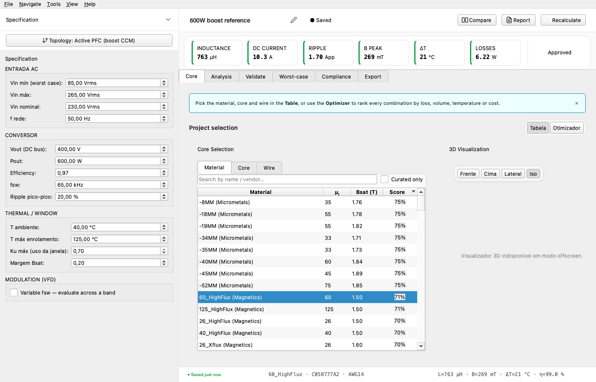

# 3. Core tab — picking material, core, wire

The **Core** tab is where you select the three components the
engine needs to size the design: a magnetic *material*, a
physical *core* shape, and a *wire* (gauge or Litz construction).

## 3.1 Topology-aware filtering

The catalogue holds hundreds of materials and thousands of cores
across all vendors. Showing every entry in every dropdown would
be useless — most are wrong for any given topology. The Core
tab filters automatically:

- **boost-CCM** at fsw = 65 kHz: powder cores
  (Magnetics 60 / 60-HighFlux / Kool-Mu / XFlux), Mn-Zn ferrites
  (TDK Epcos N87/N95/N97). Hides silicon-steel laminations
  (line-frequency only).
- **line reactor**: silicon-steel laminations (Dongxing 50H800/
  50H1300/50CS1300, AK Steel M5/M19) and amorphous /
  nanocrystalline. Hides powder cores (no DC bias to roll
  off, oversized for line-frequency duty).
- **passive choke**: same as line reactor.

The filter rule lives in
``pfc_inductor.topology.material_filter`` — see the
:doc:`/topology/index` reference for the full list.

## 3.2 Material picker

Listed in the order: **vendor** → **family** → **grade**. Each row
shows the material's headline parameters (`µ_initial`, `Bsat`
at 25 °C and 100 °C, density, type, anchored Steinmetz coefficients).

Picking a material drives:

- The core dropdown (only cores with a matching
  `default_material_id` show up).
- The Bpk vs Bsat check on the Scoreboard.
- The core-loss calculation (Steinmetz / iGSE coefficients are
  per-grade).

## 3.3 Core picker

Once you've chosen a material, this dropdown lists every core
shape that vendor offers in that grade. Each row shows:

- **Vendor / part number**
- **Shape** (Toroid / EE / EI / ETD / PQ / U-cores / …)
- **Effective area Ae [mm²]**, **path length le [mm]**, **window Wa [mm²]**, **MLT [mm]**, **AL [nH/N²]**

The right-hand panel renders four orthographic views of the
selected core (isometric, front, top, side) so you can sanity-
check the geometry before committing.

## 3.4 Wire picker

Solid magnet wire (AWG) or Litz constructions (multiple thin
strands twisted together to fight the AC skin penalty).

| Wire type | When to use |
|---|---|
| **Solid (AWG)** | DC-only or low-frequency lines (line reactors @ 50/60 Hz). The skin depth in copper is 9 mm at 60 Hz so a single conductor is fully penetrated. |
| **Litz** | Boost-PFC at fsw ≥ 50 kHz where the skin depth drops below 0.3 mm. The Project Report's section 9 quotes the 2δ check that decides this. |

The picker pre-filters wires whose copper area is in a sensible
range for the design's RMS current (a 15-A line reactor wouldn't
list AWG 30).

## 3.5 Inline optimiser

Clicking **Optimise** at the bottom of the tab opens an inline
ranker that scores every material/core/wire combination against
your spec and displays the top-N as a sortable table. Cheaper
than the full cascade optimiser (Optimizer page), good for
quick "what-if" comparisons.

The rank columns are:

- **Status** — FEASIBLE / WARNINGS / ERROR (same logic as the Scoreboard).
- **Volume** [cm³] — proxy for cost and packaging size.
- **P_total** [W] — converged loss budget.
- **T_winding** [°C] — converged steady-state temperature.
- **Margin** — saturation margin vs Bsat (the higher the better).

Click a row → click **Apply** to load that combination back into
the workspace. The Recalculate runs automatically.

## 3.6 Common pitfalls

- **Filtered-out material won't appear in the dropdown.** If you
  *know* a material should be there for your topology, double-
  check the spec's topology field — switching topology re-runs
  the filter.
- **Empty core list.** Means no core in the catalogue carries
  that material as its default. The catalogue can be extended
  through the Catalogue page (sidebar) — add a custom core +
  link it to the material id.
- **Inline optimiser shows zero feasible candidates.** Open the
  Spec drawer and check the worst-offender constraint
  (Bsat margin too tight? Ku_max too tight? Pout vs efficiency
  ratio inconsistent?). The cascade optimiser (Optimizer page)
  has a more detailed feasibility report.
