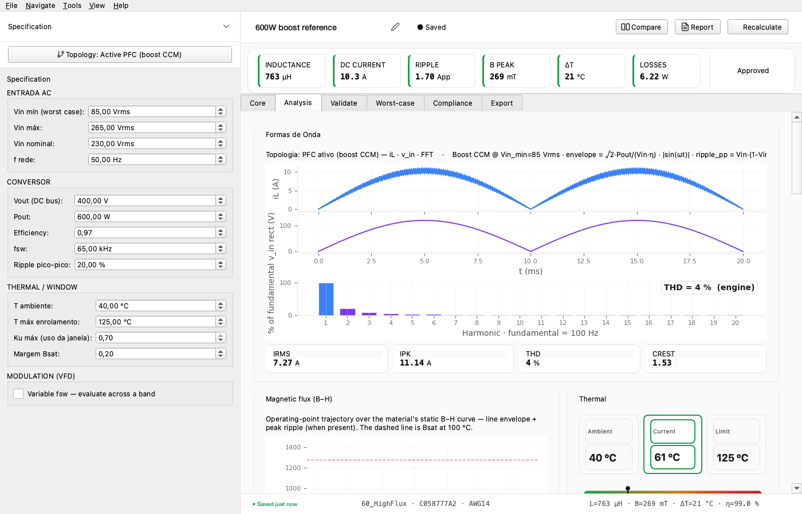
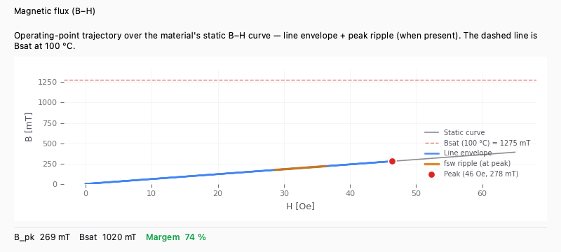
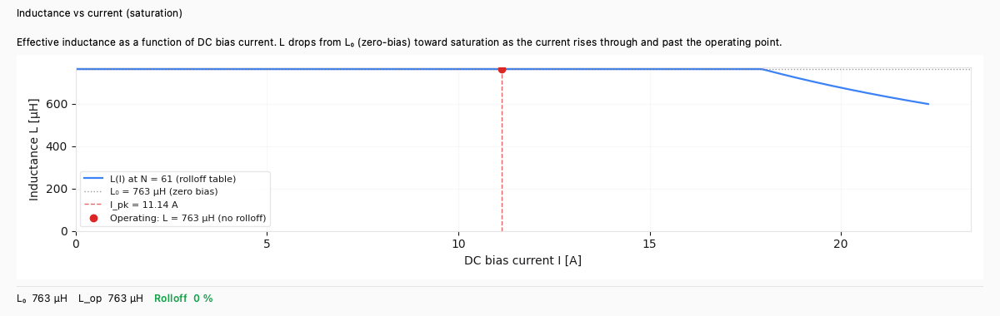
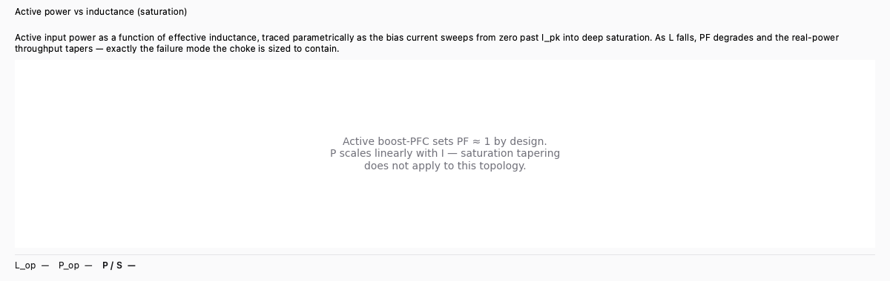
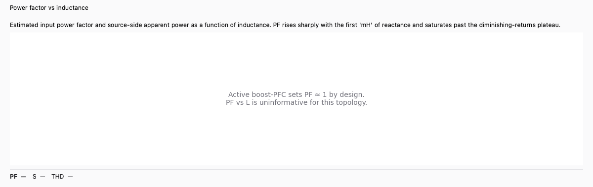

# 4. Analysis tab — reading the design

The **Analysis** tab is the workspace's read-only telemetry
dashboard. Once a design has been calculated, every card here
updates from the same `DesignResult` so the engineer can see
the operating point from many angles in one scroll.

## 4.1 The card layout

The tab is a vertical scroll of full-width cards. Layout reads
top-to-bottom with related cards grouped:

| Row | Cards | What it answers |
|---|---|---|
| 1 | **Waveforms** | What does the inductor current look like in steady state? |
| 2 | **B–H trajectory** + **Thermal gauge** | Where on the saturation knee are we? How hot does the winding run? |
| 3 | **L vs I** (saturation rolloff) | How much does L fall as the bias current rises? |
| 4 | **P vs L** (saturation throughput) | What does the falling L do to the active power? |
| 5 | **PF vs L** (design-space) | What input PF / source-side apparent power does this L give? |
| 6 | **Losses** | Stacked bar — Cu DC + Cu AC + Core (line) + Core (ripple). |
| 7 | **Winding** + **Air gap** | Turn count, layers, wire length, gap geometry. |
| 8 | **Technical details** (collapsed by default) | Every numeric output the engine produces. |
| 9 | **Modulation envelope** (boost only, when spec carries fsw band) | Per-fsw losses across the modulation band. |
| 10 | **Acoustic noise** (when computable) | Core's audible-noise budget — useful for compressor VFDs. |

## 4.2 The waveforms card

Topology-aware multi-trace plot:

- **Boost-PFC**: rectified inductor current envelope + fundamental
  voltage + B(t) — three stacked traces on a shared time axis.
- **Line reactor**: phase current (per-phase A / B / C for 3-φ),
  voltage, B(t) — same shared axis.
- **Passive choke**: rectifier-input pulse + line voltage.

Hover the chart for cursor read-outs of t / iL / B at any
point. The vertical scale is fixed across topology switches so
designs with similar amperage compare visually.

## 4.3 B–H card

The operating-point trajectory plotted on the material's
anhysteretic B–H curve. Key features:

- **Static curve** (grey) — material-only.
- **Bsat dashed line** (red) — hot saturation flux at 100 °C.
- **Line-cycle envelope** (blue) — the rectified-current
  excursion across one half cycle.
- **HF ripple overlay** (orange) — the per-switching-cycle
  ripple at the line-current peak (boost only).
- **Operating-peak marker** (red dot) — the design's worst-
  case (H, B) pair.

The summary strip below shows `B_pk · Bsat · Margin %` with
the margin tinted green/warning/danger.

## 4.4 Thermal gauge card

Gradient bar from `T_amb` to `T_max` with a needle at the
converged `T_winding`. Three numeric pills:

- **T_w** — converged winding temperature.
- **ΔT** — rise above ambient.
- **Cu / core split** — fraction of the loss budget from each origin.

## 4.5 L vs I (saturation rolloff)

Sweeps DC bias from zero to ~2 × Ipk and traces L(I).
For powder cores with a published μ%(H) rolloff polynomial the
trace comes from the vendor table; for silicon-steel / amorphous
cores it falls back to the analytical sech² model derived from
the tanh-saturation B(H). The chart title flags which model is in
use.

The summary strip reads `L₀ · L_op · Rolloff %`. The rolloff
percentage colour codes:

- **≤ 10 %** → green: small-signal control loop pole stays close
  to design.
- **≤ 25 %** → amber: workable but worth confirming the
  control loop's robustness.
- **> 25 %** → red: rolloff dominates, control bandwidth
  collapses at peak load.

## 4.6 P vs L (saturation throughput)

Pairs with the L vs I card directly above as the
*throughput* view of the same I-sweep. As I rises, L drops AND
PF degrades (passive_choke / line_reactor), so the active power
delivered by the source doesn't scale linearly with I — the
choke is *protecting* the source from delivering uncontrolled
apparent power into a saturated magnetic.

For boost-PFC topologies the card shows a friendly placeholder
(active control sets PF ≈ 1 by design, so P scales linearly
with I — saturation tapering does not apply).

## 4.7 PF vs L (design-space)

Sweeps L from 5 % to 250 % of the design value and computes
the input PF + source-side apparent power S = P / PF for each
candidate L. Useful for "if I had picked a different L, what
PF would I see?" exploration.

The strip reads `PF · S kVA · THD %`. PF colour:
**≥ 0.92** green, **≥ 0.85** amber, **< 0.85** red — same
thresholds most utility connection rules use.

## 4.8 Losses card

Stacked horizontal bar with the four loss components:

- **Cu DC** — `R_dc · I_rms²` at the converged T.
- **Cu AC** — `R_ac · I_ripple_rms²` (Dowell skin/proximity at fsw).
- **Core (line)** — anchored Steinmetz at fline.
- **Core (ripple)** — iGSE integrated over the line cycle for the
  per-θ ripple flux swing.

The bar widths sum to `P_total_W` shown at the right edge.

## 4.9 Winding + Air gap cards

- **Winding** lists turns, layers, wire ID + cross-section,
  total wire length, mass.
- **Air gap** shows the centre-leg gap, splits across legs (for
  3-leg cores), and renders a side-view of the gap geometry.

## 4.10 Technical details (collapsed)

Datasheet-style card with every number on `DesignResult` grouped
by domain (electrical, magnetic, thermal, mechanical). One click
expands; useful when the customer asks for the raw numbers.
