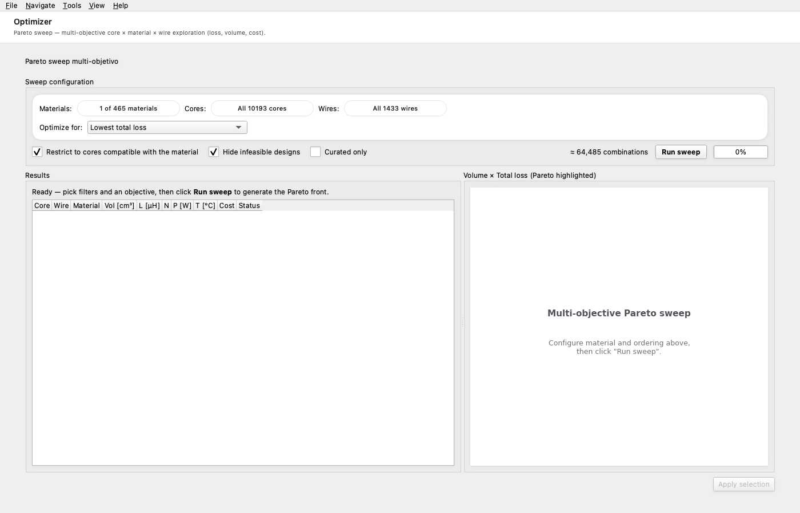

# 5. Optimizer page — cascade Pareto search

The **Optimizer** sidebar page runs a multi-stage search across
the catalogue and ranks every feasible material/core/wire
combination by your weighting of volume, losses, temperature,
and saturation margin.

## 5.1 The cascade tiers

The optimiser doesn't just brute-force the catalogue — it
*cascades* through four progressively more accurate evaluation
tiers, pruning at each step so the slow ones only see promising
candidates:

| Tier | Engine | Speed | Eliminates |
|---|---|---|---|
| **Tier 0** — feasibility prefilter | Closed-form bounds (no engine call) | Microseconds / candidate | Catastrophically infeasible: window won't fit, Bpk > Bsat by orders of magnitude. |
| **Tier 1** — closed-form analytic | Single engine pass at design point | ~10 ms / candidate | Designs that don't pass Bsat / Ku / T_max with the basic loss model. |
| **Tier 2** — refined analytic | Engine + thermal iteration to convergence | ~50 ms / candidate | Designs that drift hot once losses → temperature → resistivity converges. |
| **Tier 3** — FEA cross-check | FEMMT (ONELAB) on top-N candidates | ~30 s / candidate | Designs the analytic engine over-predicts (rare but real). |
| **Tier 4** — FEA full pass | Full multi-frequency FEA on top-K | ~3 min / candidate | (Future tier; currently same as Tier 3 with longer timeouts.) |

The *Top-N* and *Top-K* values are configurable — defaults are
30 and 10 respectively. The whole sweep typically takes 2–5
minutes for a boost-CCM design with FEA enabled.

## 5.2 Running an optimisation

1. **Load a baseline spec.** Easiest: open one of the example
   `.pfc` files on the Project page first, then navigate to
   the Optimizer.
2. **Configure the run.** The toolbar at the top picks:
   - **Mode** — closed-form only / closed-form + thermal / +
     FEA. Skip FEA for a sub-second run; turn it on for the
     definitive ranking.
   - **Top-N (Tier 3 input)** — how many candidates from Tier 2
     get the FEA cross-check.
   - **Weight sliders** — your relative preference for
     volume / losses / temperature / margin. The composite
     ranking score is a weighted sum.
3. **Start.** The progress bar shows tier-by-tier candidate
   counts and per-candidate elapsed time. You can watch
   results stream in as each tier finishes.

## 5.3 Reading the results table

| Column | Meaning |
|---|---|
| **Rank** | Score order (1 = best given current weights). |
| **Material / Core / Wire** | The combination this row evaluates. |
| **L_actual µH** | Inductance at the operating point. |
| **B_pk mT** | Peak flux density. Coloured red if > Bsat × (1 − margin). |
| **T_w °C** | Converged winding temperature. Coloured red if > T_max. |
| **P_total W** | Total losses budget. |
| **Volume cm³** | Core's effective volume (proxy for cost / packaging size). |
| **FEA L_err %** | Tier 3 / 4 result: percent error between analytic L and FEA L. Empty when FEA was skipped. |
| **FEA B_err %** | Same for B_pk. |
| **Status** | FEASIBLE / WARNINGS / FEA-skipped. |

Sort any column by clicking its header. Click a row to load
that combination back into the Project page and inspect it in
detail.

## 5.4 FEA-skipped candidates

The cascade tier 3 catches all `FEMMSolveError` and `FEMMNotAvailable`
exceptions silently. Common reasons a candidate gets marked
FEA-skipped:

- **N > 80 turns** — gmsh chokes on dense coils. The runner
  raises a clean error before even spawning the FEMMT
  subprocess. Reduce N (target a higher-AL core) for FEA
  coverage; the analytic result stands on its own otherwise.
- **FEMMT crashed natively** (subprocess exit code ≠ 0) —
  usually means the geometry hit gmsh's mesher in a degenerate
  way. The parent process recovers; the cascade keeps the
  analytic result and moves on.
- **Timeout** — gmsh / getdp got stuck for longer than
  240 seconds. Same recovery path as the crash.

The Status column reads "FEA-skipped" with a tooltip explaining
the specific cause for each row.

## 5.5 Saving the run

The toolbar's **Save run** button serialises the entire sweep
(spec + every candidate's `DesignResult`) to a `.pfcsweep`
JSON file. Re-open it later to inspect without re-running the
engine — useful when you want to compare today's sweep against
last week's.

## 5.6 Why use the Optimizer vs the inline picker?

The inline ranker (Core tab) only evaluates Tier 1 (closed-form
analytic). The Optimizer page cascades through all four tiers,
catches the analytic-engine over-predictions at the FEA stage,
and converges to a definitive ranking. Use the inline picker for
quick what-ifs; use the Optimizer for the design you'll actually
build.
