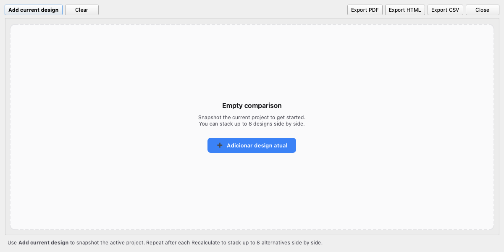

# 6. Comparison dialog — side-by-side evaluation

The **Compare** dialog stacks up to four designs (or candidate
selections) side-by-side and colour-codes every metric where
they differ. Open it from the workspace header's **Compare**
CTA or the *Optimizer page → "compare top N"* shortcut.

## 6.1 Adding designs

There are three ways to populate the comparator:

1. **Add current** — copies the active design (the one shown on
   the Project page) as a comparison column. Repeat after each
   Recalculate to capture multiple points in your design
   exploration.
2. **From Optimizer** — opens with the top-N candidates
   pre-loaded. Useful when the optimiser produced several
   close finalists you want to read against each other.
3. **Drag-and-drop** — once you have at least two columns,
   you can drag any column to a new position. Drop on the
   leftmost slot to make it the new REF.

## 6.2 The REF column

The leftmost column is always the **REF** (reference). Every
other column's metric values are colour-coded relative to it:

- **Light green** — better than REF.
- **Light red** — worse than REF.
- **White / neutral** — equal, or the metric carries no
  preference direction (e.g. raw line current — that's a
  function of spec, not a design choice).

Direction is metric-specific:

- **Lower-is-better**: P_total, T_winding, ΔT, B_pk, Rdc, volume.
- **Higher-is-better**: μ% at peak, Bsat margin.
- **Neutral**: L_actual (it's spec-driven), I_line_pk / I_line_rms
  (also spec-driven).

## 6.3 Drag-and-drop reordering

Click and hold anywhere on a column body (not the close ✕ or
Apply button — those keep their own click handlers) to grab it.
Drop on any other column position to swap. A vertical accent-
coloured indicator shows the pending insert location.

The most useful move: drop a column on the leftmost slot to
**promote it to REF**. The colour coding instantly recomputes
against the new reference.

## 6.4 Apply

Click **Apply** on any column to load that material/core/wire
combination back to the Project page. The dialog closes and the
workspace runs Recalculate against the imported selection.

## 6.5 Exporting

Three formats:

- **PDF** (default) — A4 landscape, embedded Inter font, exact
  same green/red colouring the dialog shows. Customer-grade
  artefact; print directly to a shop-floor binder.
- **HTML** — same content as the PDF but as a self-contained
  HTML file. Open in any browser; paste into a Slack post.
- **CSV** — flat data for spreadsheet analysis. Drops the
  colour coding (CSV doesn't carry styling).

The **Export** sub-menu lives both on the dialog's toolbar and
on the workspace's Export tab — same code path. From the
Export tab the comparator's `.pdf` is the default extension.

## 6.6 Slot limit

The dialog supports up to **8 slots** (changed from the legacy
limit of 4). The PDF / HTML compare layout was sized for ≤ 4
columns; with 5–8 the readable column width drops to ~30 mm,
so prefer to filter to your top 4 before exporting. The CSV
layout has no width constraint and reads fine at any slot count.

## 6.7 Use cases

- **Material A vs Material B** at the same core → reads what
  the rolloff costs in real losses.
- **Same material, two cores** → reads the volume / loss trade.
- **Same components, two specs** (e.g. nominal vs worst-case
  Vin) → reads how robustly the design degrades.
- **Optimizer top 4** → reads the fine-grain ranking the
  composite score collapsed into a single rank number.
