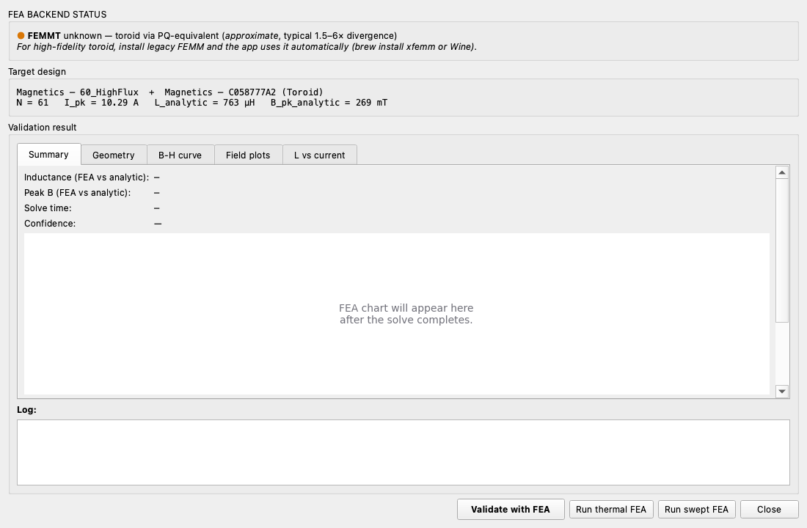

# 7. FEA validation — cross-checking the analytic engine

The **Validate** workspace tab opens the FEA dialog, which
runs the active design through a finite-element solver and
compares its `L_FEA` and `B_pk_FEA` against the analytic
engine's numbers. A < 5 % delta is a high-confidence design;
> 15 % means something disagreed and it's worth checking.

## 7.1 Backends

Two FEA backends ship today:

- **FEMMT (preferred for EE / EI / ETD / PQ)** — open-source
  Python wrapper around ONELAB / gmsh / getdp. Native
  axisymmetric magnetostatic. Free, cross-platform; the
  Python side ships with the default install since v0.4.10.
  The ONELAB binary blob (gmsh + getdp) is installed
  separately by the in-app *Tools → Install / configure FEA
  backend...* dialog.
- **Legacy FEMM (preferred for toroids)** — Lua + xfemm
  (Linux/macOS) or femm.exe (Windows). Native axisymmetric
  magnetostatic for toroidal cores. The xfemm binary ships
  with the default install; on Windows the official FEMM 4.2
  installer is needed.

The dispatcher in ``pfc_inductor.fea.runner`` picks per-shape:

| Core shape | Backend |
|---|---|
| Toroid | Legacy FEMM (high fidelity, native geometry). |
| EE / EI / ETD / PQ | FEMMT (exact mapping via ``CoreType.Single``). |
| Other | Falls back to whatever's installed; raises a clear error if neither. |

## 7.2 Backend status

The dialog opens with a status line that reads one of:

- **● green — FEMMT 0.5.x — native geometry for EE (high fidelity).**
  Everything OK. Click Validate.
- **● amber — FEMMT importable, but ONELAB is not yet configured.**
  Edit ``site-packages/femmt/config.json`` to point at your
  ONELAB folder. The folder must contain ``onelab.py``,
  ``getdp`` (or ``getdp.exe``), and ``gmsh`` (or ``gmsh.exe``).
- **● red — No FEA backend available for shape EI.** Install
  one (the install hint links to ``docs/fea-install.md``).

## 7.3 Running

Click **Validate**. Progress goes:

1. *Building FEMMT problem (axisymmetric)…* — the runner
   constructs the geometry, materials, winding, and excitation.
2. *Running gmsh / getdp…* — gmsh tessellates the geometry,
   getdp solves the magnetostatic. This takes the longest
   (5–60 s).
3. *Reading results…* — the runner extracts flux linkage,
   computes L = Φ / I, and reads Bpk from the field map.

## 7.4 Reading the result

The dialog displays:

| Row | What it shows |
|---|---|
| **Inductance** | `L_FEA µH  vs  L_analytic µH  (±X %)` |
| **Peak B** | `B_pk_FEA mT  vs  B_pk_analytic mT  (±X %)` |
| **Solve time** | Wall-clock seconds + the backend name. |
| **Confidence** | high / medium / low — based on the larger of the two pct errors. |
| **Log** | Full solver output (gmsh + getdp), useful for diagnosing issues. |
| **Notes** | Geometry mapping caveats (e.g. EE→round-leg approximation). |

Confidence thresholds:

- **High** (green): both errors ≤ 5 %.
- **Medium** (amber): largest error ≤ 15 %.
- **Low** (red): > 15 %. Investigate before relying on the design.

## 7.5 What to do when FEA disagrees

The most common causes of a > 15 % gap, with checks:

| Cause | Diagnostic | Fix |
|---|---|---|
| **Air gap mismatch** | Notes line shows ``gap=X mm (back-solved from AL_nH)``? Compare X with the catalogue's `lgap_mm`. | If the catalogue is wrong, edit it via the Catalogue page. |
| **Material μ_initial wrong** | Notes line shows the µ_eff used. Compare with the material's datasheet. | Edit the material in the catalogue. |
| **Bsat exceeded in FE** | B_pk_FEA ≫ Bsat. The FE flux clamps at Bsat × 1.05; the analytic doesn't. | Likely a real saturation issue — investigate the design. |
| **Geometry approximation** | Notes line says EE → round-leg approximation. | Expected; up to ~5 % gap is normal. |

## 7.6 N-turn ceiling

The FEMMT runner refuses to spawn FEA on designs with **N > 80**
turns because gmsh segfaults on dense coil geometries (each turn
becomes a separate curve loop in the FE primitive list, and
above ~80 the mesher crashes). The dialog shows a polite
"FEA skipped — N exceeds the safe gmsh ceiling" message; the
analytic result stands on its own.

If the design needs FEA validation but happens to be a high-N
case, two workarounds:

- **Reduce N** by picking a higher-AL core (back to the Core tab).
- **Switch to legacy FEMM** if the core is a toroid — FEMM's
  Lua geometry models the winding as a bulk current region and
  doesn't choke on high N.

## 7.7 Subprocess isolation

The actual gmsh / getdp call runs in a `multiprocessing` spawn
subprocess. Native crashes (SIGSEGV from gmsh's C extension)
die in the child; the parent recovers and raises a clean
`FEMMSolveError`. This means:

- The desktop app **never** crashes on a FEA failure — even
  pathological geometries can't take it down.
- The **cascade optimiser** (Tier 3 / Tier 4) keeps marching
  through candidates after a single FEA crash; the affected
  candidate is marked FEA-skipped.

Each FEA call pays a ~2-second subprocess startup cost
(re-importing FEMMT freshly). For interactive use that's
invisible. For the optimiser running 10 FEA validations in a
row, it adds ~20 s overhead — still cheap relative to the
~30 s gmsh/getdp solve per call.

## 7.8 Saving the FEA artefacts

The ``output_dir`` argument (CLI: ``magnadesign validate
... --output-dir <path>``) keeps the gmsh `.geo`, the getdp
`.pos`, and the raw log files for offline inspection. Default
is a tempdir that gets cleaned up; pass ``--keep-files`` for
the CLI or set `keep_files=True` in code to preserve.
