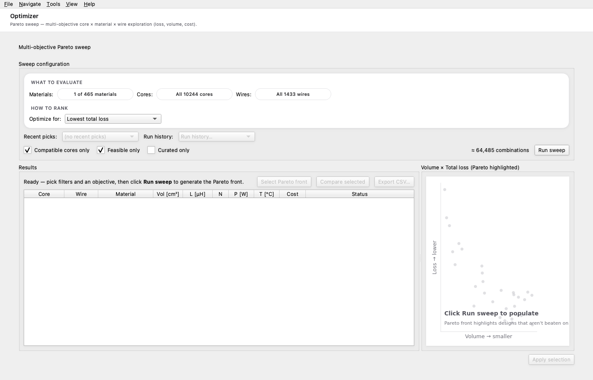

# 8. Exports — datasheet, project report, comparison

The **Export** workspace tab is the last step in the design
lifecycle. Three deliverables ship today, each targeting a
distinct reader:

| Deliverable | Reader | Format | When to use |
|---|---|---|---|
| **Datasheet** | Customer / shop floor | PDF (preferred) or HTML | Hand-off to manufacturing or a sales engineer. Spec / BOM / FAT plan / safety. |
| **Project report** | Internal engineering | PDF (LaTeX-grade) | File the design in the project tracking system. Theory / equations / derivation. |
| **Comparison** | Internal review | PDF / HTML / CSV | Side-by-side decision review with stakeholders. |

## 8.1 Datasheet PDF

A 3-page A4 portrait artefact with vector text, embedded Inter
font, and deterministic page breaks. Each page is a coherent
unit:

**Page 1 — Mechanical & Specification**

- Header (title, P/N hash, designer, revision, date, status badge).
- 4-view orthographic grid (isometric / front / top / side) of
  the chosen core + winding.
- Dimensions table (OD / ID / HT) and construction summary
  (shape, gap, wire ID, turns).
- Spec table (Inputs from the spec + Computed from the engine).

**Page 2 — Performance**

- Operating point + losses tables.
- Performance curves block:
  - Current waveform.
  - Loss breakdown.
  - **L vs I (saturation rolloff)** — the bias-induced inductance
    drop. Powder cores use the vendor's μ%(H) table; silicon-
    steel uses the analytical sech² model.
  - **P vs L (saturation throughput)** — what the saturating L
    does to the active-power throughput. Skipped for boost-PFC
    (and interleaved boost PFC) — PF ≈ 1 by active control.
  - **PF vs L (design-space)** — power factor and source-side
    apparent power as a function of choke / reactor inductance.
    Skipped for boost-PFC and interleaved boost PFC.
  - Topology-specific: switching ripple zoom (boost &
    interleaved boost PFC — the latter shows per-phase ripple
    plus the *aggregate* input ripple at `N · f_sw` after
    Hwu-Yau cancellation), harmonic spectrum vs IEC 61000-3-2
    / 3-12 / IEEE 519 (line reactor), choke before/after PF
    (passive choke).
- B–H trajectory.

**Page 3 — Bill of Materials & Notes**

- BOM (core / material / wire with parameters and total wire mass).
  For **interleaved boost PFC** the BOM lists the **per-phase**
  part with a *Quantity per converter = N* line at the top, so
  the wind-room and purchasing teams don't miss the multiplier.
- Tolerance bands (per-parameter ± typical for the material family).
- Build instructions (wind-room hand-off).
- Test plan / FAT (LCR, Rdc, hi-pot, megger, sat-current).
- Environmental ratings + insulation & safety.
- Validation status (which numbers are analytical / FEA / measured).
- Engineering notes (the engine's free-text warnings).
- Revision history + project metadata.
- Disclaimer.

## 8.2 Project report PDF

A LaTeX-grade engineering document that walks the *derivation*
of the design step-by-step. Where the datasheet is summary,
the project report is *traceable derivation*. Many engineering
teams need this artefact to file the design in their internal
project-tracking system.

Layout per topology (boost / interleaved boost PFC / line
reactor / passive choke) varies, but the structure is always:

1. **Project specification** — every input the engine consumed.
2. **Selected components** — core, material, wire with full
   datasheet-grade parameters.
3. **Theory** (1–2 paragraphs with bibliographic references).
4. **Worst-case input currents** — P_in, I_rms, I_pk derivations.
5. **Inductance derivation from first principles** — volt-
   second balance → duty cycle → ripple expression → worst
   case → solve for L_req. Each step has a labelled equation
   block.
6. **Required core size** — energy, area-product
   (Kazimierczuk eq. 4.62), comparison with the selected core's A_p.
7. **Number of turns (with rolloff)** — with the saturation
   curve at Ipk.
8. **Peak flux density verification** — paired with the
   B(N) saturation curve and the L(I) rolloff curve.
9. **Wire sizing & parallel-strands check** — current density,
   skin depth at fsw, parallel-strand recommendation.
10. **Winding resistance & copper losses**.
11. **Core losses (anchored Steinmetz / iGSE)**.
12. **Thermal verification**.
13. **Verification plots** — waveform, loss breakdown, B–H.
14. **Final summary table** — every output number consolidated.

Equations render in **Computer Modern** (the LaTeX font), so the
typography reads like a real engineering report — fractions with
proper bars, square roots with vinculum, italic variables, etc.

The "Generate project report (PDF)" CTA on the Export tab is
the entry point. The project ID defaults to the same hash the
datasheet's P/N uses, so the two artefacts cross-reference.

## 8.3 Comparison export

See [Chapter 6](06-comparison.md). The Comparison's Export sub-
menu lives both on the dialog's toolbar and on the workspace
Export tab — same code path. From the workspace tab the
default extension is `.pdf` (landscape A4, embedded Inter, exact
green/red colour coding from the dialog).

## 8.4 File-naming conventions

- Datasheet: ``datasheet_{core_part_number}_{material_name}.pdf``
- Project report: ``project_{core_part_number}_{material_name}.pdf``
- Comparison: ``comparison.pdf`` (or ``.html`` / ``.csv``)

Each replaces spaces with underscores and ``/`` with ``-`` so the
file system is happy across all platforms.

## 8.5 Why three artefacts?

Different audiences read differently:

- **Customer engineering**: needs the *datasheet* — they want
  spec / BOM / safety / test plan. They don't care how the
  design was derived.
- **Internal review board**: needs the *project report* — they
  want to verify the engineer did the maths right and that the
  numbers reconcile with the published references.
- **Design-decision meeting**: needs the *comparison* — they
  want to see candidate A vs candidate B in one page with the
  trade-offs colour-coded.

Generating all three from the same `DesignResult` keeps them
consistent: every number that appears in the datasheet appears
identically in the project report and the comparison.
